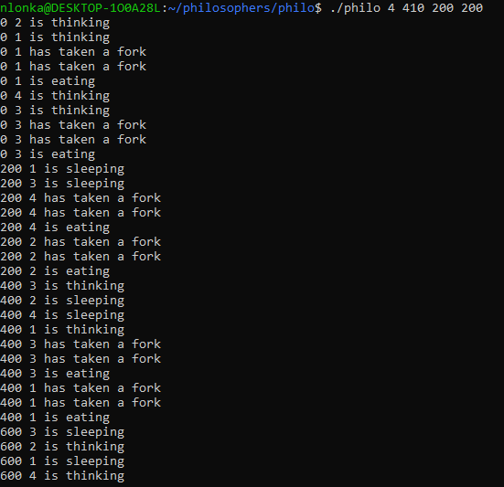

<a id="readme-top"></a>

<div align="center">
  <h2 align="center">Philosophers</h3>
</div>

<details>
  <summary>Table of Contents</summary>
  <ol>
    <li>
      <a href="#about-the-project">About the project</a>
    </li>
    <li>
      <a href="#getting-started">Getting started</a>
      <ul>
        <li><a href="#prerequisites">Prerequisites</a></li>
        <li><a href="#how-to-run-it">How to run it</a></li>
      </ul>
    </li>
    <li><a href="#usage">Usage</a></li>
    <!--<li><a href="#roadmap">Roadmap</a></li>-->
  </ol>
</details>


<!-- ABOUT THE PROJECT -->
## About the project
The point of this project is to tackle the classic [dining philosophers problem](https://en.wikipedia.org/wiki/Dining_philosophers_problem), which is about dealing with synchronizing threads and avoiding deadlocks. 
The philosophers share forks with each other and need to eat, sleep and think in rhythm to not starve to death. The goal is to use mutexes to avoid dataraces, but be careful when using them to not end up in a deadlock.

The bonus part (in directory philo_bonus) is the same concept but implemented with child processes and semaphores


<!-- GETTING STARTED -->
## Getting started

This is how you might run this program locally.
Do note that it was originally made for a unix system, so your mileage may vary depending on your machine. 

Also with this program the machine you run it on really matters, with good hardware a lot of philosophers can run with tight margins for a long time, but with poor hardware it might not be such a great time.

### Prerequisites

As this program is coded in C, you will need a compiler like gcc

### How to run it

```
git clone https://github.com/Rubidium7/philosophers.git
cd philosophers
make && ./philo <number_of_philos> <time_to_die> <time_to_eat> <time_to_sleep> [optional: <how_many_times_to_eat>]
```
- number_of_philos: how many philosophers to simulate
- time_to_die (in milliseconds): how long philosopher can go without eating (starts counting from either the beginning of the simulation or from the _beginning_ of their last meal
- time_to_eat (in milliseconds): how long it takes for philosophers to eat
- time_to_sleep (in milliseconds): how long it takes for philosophers to sleep
- how_many_times_to_eat: if all philosophers have eaten this many times the simulation stops (normally it'll go on indefinitely or until someone dies)


<!-- USAGE EXAMPLES -->
## Usage

Most hardware should happily handle under 10 philosophers. The mac i was coding this on handled 200 philosophers with a 10 millisecond margin after I optimized the program.

And with "margin" I'm referring to leaving some extra buffer milliseconds in the time_to_die variable.
For example if you have 4 philosophers and they take 200ms to eat and 200ms to sleep, having something like 405ms for the time_to_die leaves a 5ms margin.

Getting 200 philosophers on the machine i was using to live forever on input "./philo 200 410 200 200" took quite a bit of optimizing. But again on some machines that would run easily anyway and on some machines it will never work cause of the hardware :p

example of the printing:

(prints the time in milliseconds since the start, number of the philosopher in question (all philosophers get and index starting from 1) and what that philosopher is doing




<!-- ROADMAP -->
<!--## Roadmap

- [ ] Feature 1
- [ ] Feature 2
- [ ] Feature 3
    - [ ] Nested Feature -->


<p align="right">(<a href="#readme-top">back to top</a>)</p>
